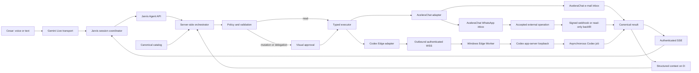

# Architecture map

Status: CANONICAL
Owner: Cesar Yukoyama / Codex
Last verified: 2026-08-19
Applies to SHA: `28744c74ff30278a658e0606f378c1c15f5f93ad`
Implementation baseline: `393031e9eec9e8583d0b8958ae399c40dd5148d3`
Branch: `codex/edge-codex-live-relay`
Remote publication: private `https://github.com/cesaryukoyama28-eng/openjarvis-codex`
Supersedes: none
Superseded by: none

## System boundary

OpenJarvis uses Gemini Live as the natural-language and realtime-audio transport.
Gemini may propose a typed function, but it is not the authorization authority and
does not execute e-mail, WhatsApp or Codex operations directly. The server-side
Jarvis Agent Core owns capability checks, policy, approval, idempotency, execution,
durable state and canonical results.

## Component ownership

| Component | Responsibility | Must not do |
|---|---|---|
| Gemini Live transport | audio, VAD, interruption, resumption, transcription and function-call transport | authorize or execute external actions |
| Jarvis frontend | select project/thread, present exact preview, collect visual decision and render timeline | own routing policy or invent tools |
| Agent API | validate HTTP contracts and delegate to services | embed business policy in routes |
| Orchestrator | session, turn, proposal, approval, dispatch, job and result lifecycle | import React or provider transport details |
| Canonical catalog | tool schema, effect, capability, provider, timeout and availability | depend on a frontend copy |
| Policy | fail-closed executor/source validation and approval requirement | fall back silently to Codex |
| Adapters | translate canonical calls to AceleraChat or Codex | decide whether an action is authorized |
| Provider ledger | correlate accepted AceleraChat writes, signed events, per-resource sequence and backfill | retry an external mutation or treat HTTP acceptance as delivery |
| Edge registry/ledger | authenticate devices, offer accepted jobs, own attempts/leases and reconcile results | queue commands for an offline device |
| Windows Edge Worker | maintain outbound WSS, execute accepted Codex work, persist terminal outcomes atomically and relay MCP through local IPC | authorize, expose 8131 or become a second Core |
| Local MCP facade | present the filtered canonical catalog to Codex over STDIO | expose Codex recursion or call legacy executors |
| SQLite store | transactional state, idempotency, jobs, context, opaque references and events | persist credentials, audio or long-lived full transcripts |

## Runtime composition

| Surface | Address or path | Configured role |
|---|---|---|
| Frontend | `127.0.0.1:5173` | Chat, Jarvis and Data Sources UI |
| Backend | `127.0.0.1:8127` | OpenJarvis API and Jarvis Agent Core |
| Codex app-server | `127.0.0.1:8131` | local Codex Desktop boundary |
| Authenticated gateway | `127.0.0.1:8140` | tracked loopback reverse proxy; the currently running legacy process remains preserved until an intentional restart |
| Active managed state | `D:\dev\runtime\openjarvis\state` | framework, knowledge and Jarvis Agent SQLite state |
| Runtime root | `D:\dev\runtime\openjarvis` | logs, backups and visual evidence; legacy direct-provider state remains preserved but inactive |
| Rollback source | `C:\Users\Cesar\.openjarvis` | preserved and inactive after the controlled copy |

The table above records configured addresses, not proof that a process is
currently running. The prepared production composition adds one Core container
bound to VPS loopback, OpenResty on 443 and one persistent Windows Edge Worker.
Those components are implemented as source and release artifacts but are not
installed or claimed live by this correction.

## Source and provider model

A Source is a logical user capability. A provider is one implementation of that
Source. A tool is available only if the selected provider currently exposes the
required capability.

| Source | Providers | Contract |
|---|---|---|
| E-mail | AceleraChat e-mail inbox | search, unread listing, message/thread reads and visually approved reply in an existing support conversation |
| WhatsApp | AceleraChat WhatsApp inbox | status, contact/chat search, history reads, summary context, visually approved text and internal read marker |
| Codex | Codex Desktop | status/history reads and visually approved delegation |
| Jarvis | local | privacy-safe operational audit |
| Hacker News | existing connector | preserved in storage, excluded from the Jarvis manifest |

The general connector registry and connector `mcp_tools()` remain broader project
metadata. They are not executable Jarvis authority. The manifest for each Live
session is generated from the canonical server catalog and current capabilities.
Direct Gmail/IMAP and Baileys code and state are preserved for provenance and
rollback, but they are not composed into the active Jarvis orchestrator and are
filtered from Data Sources. Provider connection and QR/account administration
belong to AceleraChat, not to the OpenJarvis browser.

That boundary is enforced, not merely presented: in VPS mode the legacy customer
source router is absent, the four direct connector IDs are hidden and rejected,
and unknown backend routes return JSON `404` instead of falling through to the
SPA. Local mode retains the legacy routes only for compatibility and rollback.

## Public contracts

- API prefix: `/v1/jarvis/agent`.
- Selected existing Codex task turn:
  `POST /v1/codex/threads/{thread_id}/turns`.
- Selected-task synchronization:
  `GET /v1/codex/threads/{thread_id}/events`.
- Generated OpenAPI artifact: `contracts/jarvis-agent.openapi.json`.
- Generated frontend types:
  `frontend/src/features/jarvis/api/generated-contracts.ts`.
- Edge protocol schemas and fixtures: `contracts/edge/v1`.
- Hybrid Edge/MCP contract: `docs/project/JARVIS-EDGE-MCP-CONTRACT.md`.
- Hybrid release/rollback runbook:
  `docs/project/operations/JARVIS-EDGE-MCP-RUNBOOK.md`.
- Domain and policy:
  `src/openjarvis/server/jarvis_agent/domain` and
  `src/openjarvis/server/jarvis_agent/registry`.
- Detailed contract: `docs/project/JARVIS-AGENT-CONTRACT.md`.
- Operations and rollback: `docs/project/operations/JARVIS-AGENT-RUNBOOK.md`.
- Clean Windows reproduction:
  `docs/project/operations/FRESH-WINDOWS-INSTALL.md`.
- Remote-access gateway: `src/openjarvis/server/remote_access`.
- Remote-access lifecycle: `scripts/workspace/start-remote-access.ps1` and
  `scripts/workspace/stop-remote-access.ps1`.

## Compatibility boundary

The legacy frontend regex router, fixed tool catalog and duplicate delegation
coordinator were removed. `gemini-live.ts` remains a transport facade composed
from smaller audio, setup and transcript modules. There is exactly one active
orchestrator per Jarvis session: the server-side Jarvis Agent Core.

Codex remains an external agent. It is not an Ollama model, an OpenAI-compatible
engine choice or a provider key. Authentication, workspace, thread identity and
Desktop state remain owned by Codex.

The Cloudflare Quick Tunnel is an optional transport outside the Agent Core. It
terminates at the authenticated loopback gateway, never directly at the backend.
Its public URL and QR Code are runtime artifacts on D: and are never source
files. Quick Tunnels are a test surface with a random URL and no SSE support;
the remote frontend therefore uses bounded reconciliation instead of treating
the tunnel as a production event transport.

The only unauthenticated gateway exception is the exact `POST` path for the
AceleraChat webhook. Browser Basic Auth is not applicable to a provider callback;
the backend still requires a current or rotation-overlap HMAC signature, a fresh
timestamp, a UUID delivery ID and a bounded body before persisting the event.

The production Edge boundary does not use the Quick Tunnel. The Core accepts an
outbound authenticated WSS worker and never publishes Codex app-server 8131.
Codex local MCP uses STDIO plus an authenticated Windows named pipe to the
persistent worker. The worker owns a separate, path-allowlisted HTTPS credential
for the Core; Codex never receives it. Remote MCP `/mcp` remains disabled.
