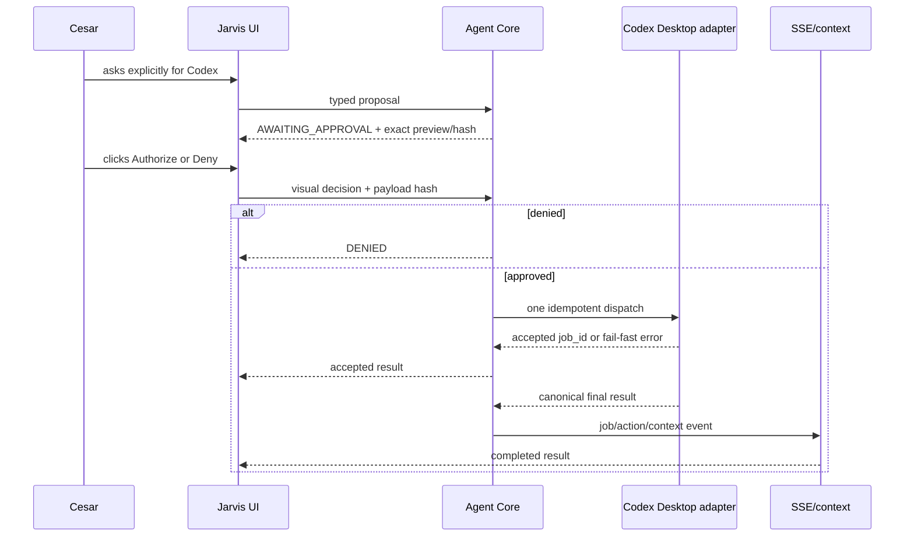

# Codex agent integration

Status: CANONICAL
Owner: Cesar Yukoyama / Codex
Last verified: 2026-08-19
Applies to code SHA: `df82a3c2a1f138837cbbf88f2a303908adeb754e`
Functional dispatch: `343a62c52d75dc73d3d30e9a671d13f60434d637`
Functional state relay: `5493484fca5d4ce81a4892bec9a1826cffbfe93a`
Durable admission and terminal outcome: `df82a3c2a1f138837cbbf88f2a303908adeb754e`
Branch: `codex/edge-live-relay-release`
Supersedes: none
Superseded by: none

## Contract

Codex is a first-class external executor selected by project and immutable Codex
thread. It is not an `InferenceEngine`, does not require Ollama and must not be
treated as a normal model API. The installed Codex app-server remains the owner
of authentication, threads, turns, approvals, sandbox and workspace context.

The Jarvis Agent Core exposes three typed capabilities:

| Tool | Effect | Approval | Result |
|---|---|---|---|
| `codex_get_status` | read | automatic | bounded availability/busy status |
| `codex_read_recent_history` | read | automatic | sanitized recent public history |
| `codex_delegate_task` | delegation | visual, one use | accepted job followed by canonical completion event |

The selected OpenJarvis conversation uses a separate explicit UI transport:
`POST /v1/codex/threads/{thread_id}/turns`. Its request is closed to
`project_cwd`, `message`, `client_user_message_id` and `conversation_id`. The
server preserves the exact task and client message identities and derives the
idempotent Edge job; the browser does not submit a provider `job_id` or a new
thread identifier.

## Delegation sequence



## Authorization and idempotency

- A spoken confirmation never authorizes Codex.
- The decision route requires `X-Jarvis-Decision-Channel: visual`.
- Approval binds `session_id`, `action_id`, `function_call_id` and
  `payload_hash`.
- A changed project, thread or prompt produces a new proposal.
- A duplicate function call returns the existing action or result.
- A second click cannot create a second Codex turn.
- Closing a session cancels unapproved proposals and invalidates callbacks from
  the previous session generation.

## Busy, timeout and unknown outcomes

Codex concurrency fails fast. There is no hidden queue and no retry that could
duplicate a turn.

| Condition | Public state/code | Behavior |
|---|---|---|
| selected thread is active | `BUSY` / `CODEX_BUSY` | immediate refusal; proposal may be recreated manually later |
| thread invalid | `FAILED` / `CODEX_THREAD_INVALID` | no dispatch |
| resume deadline | `FAILED` / `CODEX_THREAD_RESUME_TIMEOUT` | no automatic retry |
| dispatch deadline before known start | `FAILED` / `CODEX_DISPATCH_TIMEOUT` | no automatic retry |
| external mutation outcome cannot be proved | `UNKNOWN` / `EXTERNAL_RESULT_UNKNOWN` | operator must inspect canonical history before retrying |
| executor result is invalid or exceeds 256 KiB | `UNKNOWN` / `EXTERNAL_RESULT_UNKNOWN` | small durable failure replaces the unrepresentable result; no automatic retry |

Status preflight uses a bounded, history-free thread read. Full history is read
only for explicit history requests or final-result reconciliation. Optional
history cannot block the start of Gemini Live.

An explicit history page is bounded to 30 messages, 8 KiB of UTF-8 content per
message and 128 KiB of content in total. It preserves both cursors and marks
truncated entries. This read-only pagination rule does not authorize truncating
an arbitrary delegation or mutation result.

The selected-conversation SSE is also independent from execution resume. It
returns `connected` immediately, publishes `synchronized` after a canonical
snapshot, and uses the non-terminal `degraded` state while an active Desktop
task delays full history. Degraded reads remain on the same SSE connection and
use coalesced bounded backoff; they do not trigger browser reconnects.

## Canonical response

A transport acknowledgment is not an assistant answer. The action/job event and
the selected Codex thread history are reconciled under the same identifiers. The
complete public response is then written to the Jarvis timeline, OpenJarvis Chat
and structured context. Reasoning, internal tool payloads and credentials are
excluded.

Real app-server lifecycle signals are delivered as ordered `execution` SSE
events for turn start/completion, item start/completion and status changes. They
retain the sanitized Edge `event_id` and sequence. Public message/delta events
are flushed before their associated execution signal, stale sequences are
ignored, and canonical history repairs a missed presentation event without
starting another turn.

If the Codex job finishes after the voice session closes, the backend keeps the
job and bounded result summary. The next session for the same project/thread can
recover it without replaying the old user transcript.

## Last runtime validation (historical, not current activation)

- Codex process: listening on `127.0.0.1:8131`; the direct generic
  `/health` path is not part of its contract and returns HTTP 400.
- Backend Codex contract: `/v1/codex/catalog` and `/v1/info` returned HTTP 200,
  with `engine=codex_app_server`.
- `codex_get_status`: completed in the real read-only smoke.
- `codex_read_recent_history`: completed on an idle real task.
- Explicitly reading the currently active task produced a bounded timeout.
- Its selected-conversation SSE returned HTTP 200 immediately with `connected`
  then one `degraded` state; the backend recorded zero legacy resume-gate
  failures and did not enter an HTTP 503 reconnect loop.
- A real delegation was not approved or dispatched during this implementation.
- Busy, duplicate, timeout, close and async job behavior are covered by fakes and
  contract tests.

No Codex app-server, Edge Worker, browser or shared Desktop runtime was started
while implementing or reconciling the integrated release checkpoints through
`df82a3c`. Read-only VPS preflight was performed separately; no runtime or
external channel mutation was triggered.

## Prepared VPS and Edge path

The local direct adapter remains the accepted development path. The prepared
production composition replaces direct VPS access to 8131 with:

```text
Agent Core on VPS -> accepted Edge job -> outbound WSS -> Windows Edge Worker
-> loopback Codex app-server -> canonical Edge result -> Agent Core
```

The Core owns the job, immutable payload hash, attempt and lease. A worker that
is offline before acceptance causes an immediate `DEVICE_OFFLINE`; no approved
command waits for reconnection. Only an already accepted attempt and its result
may be reconciled after a disconnect. Nested native Codex approval is surfaced
as a second exact visual approval correlated to the outer Jarvis action.

Codex also receives a filtered MCP STDIO facade for non-Codex tools. STDIO talks
to the persistent Edge Worker through an authenticated Windows named pipe. The
worker relays only five required Agent Core route shapes using an independent
HTTPS Bearer. The facade does not expose `codex.*`, cannot approve/revoke and
does not use the legacy `ToolExecutor`.

Automated proof covers WSS contracts, Edge persistence/recovery, Windows named
pipe round trip, MCP filtering/idempotency, nested approvals and bounded remote
history reconciliation. A real VPS/Edge/visual smoke remains a release gate and
has not been claimed.

## Known platform limitation

The Codex Desktop UI and OpenJarvis use separate clients of the app-server.
Cross-process token deltas are not guaranteed to appear simultaneously in both
windows. Canonical final messages and job state synchronize; the implementation
does not claim unsupported token-by-token Desktop mirroring.

## Prohibited shortcuts

- Do not invoke Codex because a request merely mentions a Gmail or WhatsApp
  problem; Codex must be the explicit executor.
- Do not convert `sim`, `confirmo` or a function response into a Codex prompt.
- Do not resume the full thread before every status check.
- Do not make `thread/resume` a prerequisite for read-only history SSE.
- Do not retry an uncertain dispatch.
- Do not send a placeholder such as “comando concluído pelo Codex” when the
  canonical response exists.
- Do not bypass the server policy from the frontend or Gemini prompt.
