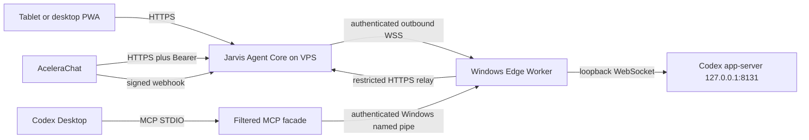

# Jarvis Edge Worker and MCP contract

Status: CANONICAL — IMPLEMENTED LOCALLY, DEPLOYMENT PENDING
Owner: Cesar Yukoyama / Codex
Last verified: 2026-08-18 13:20:52 -03:00
Implementation base: `4b2b16ab6ffce6f100180cfa40780f8296690515`
Branch: `codex/vps-edge-mcp`

## Purpose

This contract defines the hybrid boundary that keeps the Jarvis Agent Core on
the VPS while Codex Desktop remains on Cesar's Windows computer. It also defines
the filtered MCP surface consumed by local Codex. It does not authorize a VPS
deployment, DNS change, credential change or external mutation.

The AceleraChat contract remains unchanged at `2026-08-18.2`. AceleraChat owns
e-mail, WhatsApp, contacts and conversations. The Edge Worker owns no provider
identity and does not create a second Agent Core.

## Topology and authority



| Component | Authority | Prohibited behavior |
|---|---|---|
| Agent Core | sessions, proposals, policy, approvals, actions, jobs, catalog, context and canonical events | wait for an offline worker or execute without policy |
| Edge Worker | maintain one outbound WSS connection, execute accepted local Codex jobs and relay local MCP calls | expose 8131, retain future commands or become an orchestrator |
| MCP facade | map the current canonical catalog to MCP STDIO | call legacy `ToolExecutor`, expose `codex.*` or start/control the worker |
| Codex app-server | own Codex authentication, projects, tasks, turns and native approvals | listen outside loopback |
| PWA | show exact approvals and canonical results | authorize by voice or invent a tool |

## Public and local surfaces

| Surface | Contract |
|---|---|
| PWA | `https://openjarvis.meugerenciador.pro/jarvis` after deployment |
| Agent Core | `/v1/jarvis/agent/*` behind interface authentication |
| Gemini Live | `/v1/jarvis/live/status`, `/token` and `/events` |
| Edge | `wss://openjarvis.meugerenciador.pro/edge` with device Bearer |
| AceleraChat callback | exact signed webhook path, without browser Basic Auth |
| MCP relay gateway | `/local-agent/v1/jarvis/agent/*`, Edge-only Bearer |
| Local MCP IPC | `\\.\pipe\openjarvis-agent-mcp`, independent local token |
| Codex app-server | `ws://127.0.0.1:8131` only |
| Remote MCP | disabled and outside this release |

The OpenResty gateway denies unlisted paths. The MCP relay allows only catalog,
session creation, proposal creation, action status and session close. It cannot
approve an action, revoke a device, read arbitrary context or reach generic chat
and administrative routes.

## Edge protocol

Version `1.0` uses closed JSON schemas under `contracts/edge/v1`. Every frame
contains `schema_version`, unique `event_id`, `type`, `device_id`, UTC
`occurred_at`, monotonic `sequence`, optional stable `job_id` and a bounded
payload. Maximum application frame size is 256 KiB.

Client to Core:

- `edge.register`, `edge.heartbeat`, `edge.resume`, `edge.goodbye`;
- `job.accepted`, `job.rejected`, `job.progress`;
- `approval.required`;
- `job.succeeded`, `job.failed`, `job.cancelled`.

Core to client:

- `edge.registered`, `edge.heartbeat_ack`, `edge.error`;
- `job.offer`, `job.cancel`;
- `approval.resolved`;
- `edge.rotate_credentials`.

The generated schema bundles and sanitized fixtures are executable evidence.
Unknown frame types, wrong direction, unknown payload fields, oversized bodies,
duplicate events and sequence rollback fail closed.

## Device identity, connection and recovery

- The worker always initiates WSS over port 443; Windows opens no public port.
- Device credentials are independent from AceleraChat, webhook, browser, MCP
  Core-relay and local-pipe credentials.
- Edge, Core-relay and local-pipe tokens must contain at least 32 characters;
  placeholder or partial configuration fails startup.
- Current and previous device credentials may overlap only until an explicit
  expiry. Logs contain fingerprints, never complete values.
- Heartbeats are bounded. An expired heartbeat produces real offline state.
  `edge.heartbeat_ack` is emitted only for `edge.heartbeat` and acknowledges
  the highest client sequence durably recorded at that point. Job lifecycle
  frames are therefore acknowledged by the next periodic heartbeat instead of
  generating one redundant durable response per frame.
- Reconnect uses exponential backoff with jitter and a bounded maximum.
- A device can be revoked immediately. Re-registration does not clear revoked
  state implicitly.
- The worker spool contains only frames/results for jobs already accepted or
  completed. It is not a queue of future approved commands.

If a worker is offline before offer/acceptance, the action fails as
`DEVICE_OFFLINE`; a user must create and approve a new proposal after recovery.
Reconnect may only resume a previously accepted attempt and replay its durable
result. It never executes an old command merely because connectivity returned.

Codex history exposed by the VPS is synchronized through bounded Edge read
jobs because app-server notifications remain local to Windows. The Edge runtime
uses a ten-second cadence; direct/local runtimes retain the two-second default.
This interval affects only remote history freshness, not job execution,
heartbeats, voice streaming or approval delivery.

## Job and nested-approval lifecycle

```text
APPROVED -> OFFERED -> ACCEPTED -> RUNNING
                                -> WAITING_APPROVAL -> RUNNING
                                -> SUCCEEDED | FAILED | CANCELLED | EXPIRED
```

- Core assigns stable `job_id`, immutable payload hash, attempt and lease.
- Offer acceptance has a separate short timeout.
- Only accepted/running jobs survive a connection loss for reconciliation.
- A duplicate terminal job returns its stored outcome and does not execute.
- Cancellation uses Codex interruption only when the app-server supports it.
- An uncertain external outcome is `UNKNOWN`; there is no automatic retry.
- A native Codex approval becomes a nested Edge approval correlated to the
  outer Jarvis action/session.
- The PWA displays at most one active approval surface. The nested exact
  approval takes precedence while it is pending.
- Only a visual decision with the displayed hash can resolve it. Voice cannot.

## Codex execution contract

The Edge Worker reuses the existing local app-server protocol:

- project roots are allowlisted on D:;
- a mapped task is resumed only when valid;
- a new task is created only when no valid mapping exists;
- work begins with `turn/start` and may be interrupted with `turn/interrupt`;
- progress excludes reasoning, command internals and credentials;
- final public history is reconciled by stable message identity;
- the app-server remains unauthenticated only because it is loopback-only.

Remote Core reads use bounded Edge jobs. Remote history synchronization is
poll-based reconciliation because the Edge process and Codex Desktop are
separate app-server clients; token-by-token cross-process mirroring is not
claimed.

## MCP local contract

The entry point is `openjarvis-agent-mcp` over STDIO. Standard output is reserved
for JSON-RPC; diagnostics use standard error. The facade:

- initializes with short safety instructions;
- derives `tools/list` from the canonical server catalog;
- removes every tool with source/ID `codex.*`;
- exposes at most 13 currently eligible tools;
- preserves JSON Schema and read/destructive annotations;
- sends `tools/call` into a canonical Agent Core proposal;
- requires a JSON-RPC request ID for tool calls;
- derives a stable function-call ID from request ID plus exact payload;
- waits only for the canonical action state;
- never executes through the legacy MCP `ToolExecutor`.

The STDIO process receives only the local named-pipe token. The persistent Edge
Worker separately owns the Core-relay Bearer and performs a path-allowlisted
HTTPS call. Closing Codex or STDIO does not stop the Edge Worker.

## Persistence and retention

The Agent Core SQLite schema stores devices, jobs, attempts, leases, Edge event
deduplication, approvals and canonical operational events. WAL, foreign keys and
a busy timeout are enabled.

- Edge audit events: 90 days.
- Terminal/transient job material: 30 days, with sensitive payload removed.
- Previous credential: explicit expiry; 24-hour overlap is the release target.
- Heartbeats: current state only, not indefinite history.
- Local worker spool: accepted/recoverable work only.
- Full transcripts, audio, QR values, tokens and reasoning: never persisted.

Retention runs at most hourly during normal store activity. A Core restart
marks unrecoverable local dispatches `UNKNOWN`, closes stale sessions and
preserves recoverable Edge assignments.

## Container and gateway contract

The VPS artifact builds the tracked PWA and Python server from lockfiles. The
runtime is non-root UID/GID 10001, read-only, capability-free, resource-limited,
health-checked, bound to VPS loopback and uses one Uvicorn worker because state
and live registries are process-local around durable SQLite.

External mutations start disabled with
`OPENJARVIS_EXTERNAL_MUTATIONS_ENABLED=false`. OpenResty remains the sole
listener on 80/443 and supplies TLS, Basic Auth for the PWA/API, Edge WebSocket
upgrade, independent webhook handling, rate limits, CSP and deny-by-default.

## Stable failure semantics

Important public failures include:

- `DEVICE_OFFLINE`, `DEVICE_REVOKED`, `EDGE_OFFER_TIMEOUT`;
- `EDGE_LEASE_EXPIRED`, `EDGE_PROTOCOL_ERROR`;
- `APPROVAL_REQUIRED`, `APPROVAL_EXPIRED`, `APPROVAL_PAYLOAD_MISMATCH`;
- `CODEX_BUSY`, `CODEX_THREAD_INVALID`, `CODEX_DISPATCH_TIMEOUT`;
- `DUPLICATE_ACTION`, `SESSION_CLOSED`, `EXTERNAL_RESULT_UNKNOWN`;
- local-only `LOCAL_RELAY_PATH_DENIED`, `LOCAL_RELAY_OFFLINE` and
  `AGENT_CORE_UNAVAILABLE`.

Errors never include stack traces, tokens, private paths or provider content.

## Prohibited shortcuts

- No inbound Windows listener, Quick Tunnel or public app-server.
- No shell/filesystem/browser tool and no generic HTTP proxy.
- No `codex_delegate_task` in the Codex-local MCP surface.
- No voice authorization or retry after uncertain mutation.
- No worker-managed second catalog, policy or Agent Core.
- No command retained for future execution while the worker is offline.
- No shared credential across Edge, MCP, browser, AceleraChat and webhook.
- No remote MCP `/mcp` until separately authorized and designed.

## Acceptance boundary

Automated tests prove protocol, persistence, rotation overlap, revocation,
reconciliation, nested approval, MCP filtering/idempotency, a real Windows named
pipe round trip, PWA contracts and fail-closed release artifacts. Production
acceptance additionally requires an authorized VPS build/deploy, DNS/TLS,
container digest, Edge connection, read-only smokes and visual PWA proof. None
of those external changes is implied by this document.
