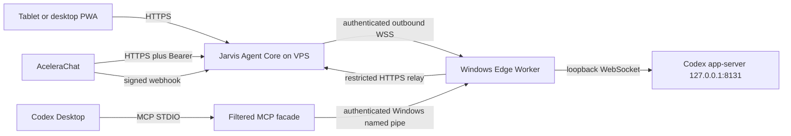

# Jarvis Edge Worker and MCP contract

Status: CANONICAL — CONTROLLED CORE AND EDGE ACTIVE; MUTATIONS DISABLED
Owner: Cesar Yukoyama / Codex
Last verified: 2026-08-19
Applies to code SHA: `1ecb90ac6191c27501c2ca497c2deecdf5bad8e0`
Production-source baseline: `9874381c9df924e9d439ecb958761a6df27586b1`
Branch: `codex/edge-live-relay-release`
Supersedes: none
Superseded by: none

## Purpose

This contract defines the hybrid boundary that keeps the Jarvis Agent Core on
the VPS while Codex Desktop remains on Cesar's Windows computer. It also defines
the filtered MCP surface consumed by local Codex. It does not authorize a VPS
redeployment, DNS change, credential change or external mutation beyond the
controlled evidence explicitly recorded for the active release.

The AceleraChat contract is `2026-08-19.2`. AceleraChat owns
e-mail, WhatsApp, contacts and conversations. The Edge Worker owns no provider
identity and does not create a second Agent Core.

The independently audited source code ended at `11a6c424`; it was reapplied over
the real private production-source baseline to preserve production-only audio,
worklet and diagnostic paths. Traceable release checkpoints are:

- `84bcba756922845a551b6c04b652b43e048ab963` plus `95f3d14f0b99398f54f3094d3567233e3d32a5e7`:
  live-state relay and durable reconnect replay;
- `343a62c52d75dc73d3d30e9a671d13f60434d637`: selected-task turn dispatch;
- `5493484fca5d4ce81a4892bec9a1826cffbfe93a`: ordered execution-state relay;
- `21c94819a707c86a9e81d9ce866f1bd4de02b364`: VPS channel authority;
- `35ee771277a687d1c80398520920cee77e040f2b` plus `4a1db681ed4374ca63672d42d8b8c860f9dec16d`:
  reserved terminal outcomes and bounded atomic admission;
- `49e99f2f76fbb33679e33f987c7e422c62054137`: strict nested result mappings;
- `955cf84081cec1cfa67e94077d412b96fb190e38`: focused bounded-history serialization;
- `c31bd49cfb8125438af1ae3ae4f305090828f70e`: production-base reconciliation;
- `df82a3c2a1f138837cbbf88f2a303908adeb754e`: focused connection safety;
- `1ecb90ac6191c27501c2ca497c2deecdf5bad8e0`: strict live effect mapping and
  PATH-independent Windows MCP startup.

## Topology and authority



| Component | Authority | Prohibited behavior |
|---|---|---|
| Agent Core | sessions, proposals, policy, approvals, actions, jobs, catalog, context and canonical events | wait for an offline worker or execute without policy |
| Edge Worker | maintain one outbound WSS connection, execute accepted local Codex jobs and relay local MCP calls | expose 8131, retain future commands or become an orchestrator |
| MCP facade | map the current canonical catalog to MCP STDIO | call legacy `ToolExecutor`, expose `codex.*` or start/control the worker |
| Codex app-server | own Codex authentication, projects, tasks, turns and native approvals | listen outside loopback |
| PWA | show exact approvals and canonical results | authorize by voice or invent a tool |

In VPS mode, AceleraChat is enforced as the only customer e-mail and WhatsApp
authority. The legacy Gmail, Gmail/IMAP, WhatsApp and Baileys connector IDs are
absent from connector discovery and fail closed on direct access. Legacy source
routes are not mounted. An unknown backend path returns a JSON `404`; it can
never be mistaken for a successful SPA navigation.

## Public and local surfaces

| Surface | Contract |
|---|---|
| PWA | `https://openjarvis.meugerenciador.pro/jarvis` |
| Agent Core | `/v1/jarvis/agent/*` behind interface authentication |
| Gemini Live | `/v1/jarvis/live/status`, `/token` and `/events` |
| Edge | `wss://openjarvis.meugerenciador.pro/edge` with device Bearer |
| AceleraChat callback | exact signed webhook path, without browser Basic Auth |
| MCP relay gateway | `/local-agent/v1/jarvis/agent/*`, Edge-only Bearer |
| Local MCP IPC | `\\.\pipe\openjarvis-agent-mcp`, independent local token |
| Codex app-server | `ws://127.0.0.1:8131` only |
| Remote MCP | disabled and outside this release |

The OpenResty gateway denies unlisted paths. The MCP relay allows only catalog,
session creation, proposal creation, action status and session close. It cannot
approve an action, revoke a device, read arbitrary context or reach generic chat
and administrative routes.

## Edge protocol

Version `1.0` uses closed JSON schemas under `contracts/edge/v1`. Every frame
contains `schema_version`, unique `event_id`, `type`, `device_id`, UTC
`occurred_at`, monotonic `sequence`, optional stable `job_id` and a bounded
payload. Maximum application frame size is 256 KiB.

Client to Core:

- `edge.register`, `edge.heartbeat`, `edge.resume`, `edge.goodbye`;
- `job.accepted`, `job.rejected`, `job.progress`;
- `approval.required`;
- `job.succeeded`, `job.failed`, `job.cancelled`.

Core to client:

- `edge.registered`, `edge.heartbeat_ack`, `edge.error`;
- `job.offer`, `job.cancel`;
- `approval.resolved`;
- `edge.rotate_credentials`.

The generated schema bundles and sanitized fixtures are executable evidence.
Unknown frame types, wrong direction, unknown payload fields, oversized bodies,
duplicate events and sequence rollback fail closed.

## Device identity, connection and recovery

- The worker always initiates WSS over port 443; Windows opens no public port.
- Device credentials are independent from AceleraChat, webhook, browser, MCP
  Core-relay and local-pipe credentials.
- Edge, Core-relay and local-pipe tokens must contain at least 32 characters;
  placeholder or partial configuration fails startup.
- Current and previous device credentials may overlap only until an explicit
  expiry. Logs contain fingerprints, never complete values.
- Heartbeats are bounded. An expired heartbeat produces real offline state.
  `edge.heartbeat_ack` is emitted only for `edge.heartbeat` and acknowledges
  the highest client sequence durably recorded at that point. Job lifecycle
  frames are therefore acknowledged by the next periodic heartbeat instead of
  generating one redundant durable response per frame.
- Reconnect uses exponential backoff with jitter and a bounded maximum.
- A device can be revoked immediately. Re-registration does not clear revoked
  state implicitly.
- The worker spool contains only frames/results for jobs already accepted or
  completed. It is not a queue of future approved commands.
- The normal spool partition is bounded by both frame count and encoded bytes.
  Defaults are 10,000 frames and 64 MiB, with replay pages of 100 frames; all
  three are configurable through the documented Edge environment variables.
- A separate non-configurable reserve holds at most 64 terminal frames of at
  most 256 KiB each. The total default upper bound is therefore 10,064 frames
  and 80 MiB; the reserve cannot become a general event queue.
- Job admission reserves one terminal slot and writes the local `ACCEPTED` row
  plus its durable `job.accepted` frame in one SQLite transaction. If the normal
  partition cannot persist that frame, neither record exists and execution does
  not begin. A send failure after this commit leaves acceptance pending for
  replay and does not cancel already durably admitted work.
- Terminal frame and local terminal state are written in one SQLite transaction.
  A success payload that is invalid, non-serializable or above 256 KiB cannot
  leave the job active: it becomes a small durable `UNKNOWN` / `job.failed` /
  `EXTERNAL_RESULT_UNKNOWN` result. Arbitrary mutation results are never silently
  truncated or automatically retried.
- Omitted `data` and `references` fields normalize to empty mappings. If either
  field is present, it must be a mapping; any other type uses the same durable
  `UNKNOWN` outcome and can never be recorded as `SUCCEEDED`.
- `edge.register` is transient control traffic and is never persisted as an
  application frame. After `edge.registered`, the worker reconciles the Core
  acknowledgement high-water mark, replays unacknowledged durable frames in
  pages, and only then sends `edge.resume`.

If a worker is offline before offer/acceptance, the action fails as
`DEVICE_OFFLINE`; a user must create and approve a new proposal after recovery.
Reconnect may only resume a previously accepted attempt and replay its durable
result. It never executes an old command merely because connectivity returned.

Codex history exposed by the VPS is synchronized through bounded Edge read
jobs because app-server notifications remain local to Windows. The Edge runtime
uses a ten-second cadence; direct/local runtimes retain the two-second default.
This interval affects only remote history freshness, not job execution,
heartbeats, voice streaming or approval delivery.

## Job and nested-approval lifecycle

```text
APPROVED -> OFFERED -> ACCEPTED -> RUNNING
                                -> WAITING_APPROVAL -> RUNNING
                                -> SUCCEEDED | FAILED | CANCELLED | UNKNOWN | EXPIRED
```

- Core assigns stable `job_id`, immutable payload hash, attempt and lease.
- Offer acceptance has a separate short timeout.
- `ACCEPTED` means both the worker job and its acceptance frame are durable.
- Only accepted/running jobs survive a connection loss for reconciliation.
- Interrupted work remains `RECOVERY_PENDING` locally until its `UNKNOWN`
  terminal frame is durable; a restart republishes it rather than losing it.
- A duplicate terminal job returns its stored outcome and does not execute.
- Cancellation uses Codex interruption only when the app-server supports it.
- An uncertain external outcome is `UNKNOWN`; there is no automatic retry.
- A native Codex approval becomes a nested Edge approval correlated to the
  outer Jarvis action/session.
- The PWA displays at most one active approval surface. The nested exact
  approval takes precedence while it is pending.
- Only a visual decision with the displayed hash can resolve it. Voice cannot.

## Codex execution contract

The Edge Worker reuses the existing local app-server protocol:

- project roots are allowlisted on D:;
- a mapped task is resumed only when valid;
- a new task is created only when no valid mapping exists;
- work begins with `turn/start` and may be interrupted with `turn/interrupt`;
- progress excludes reasoning, command internals and credentials;
- final public history is reconciled by stable message identity;
- the app-server remains unauthenticated only because it is loopback-only.

The OpenJarvis UI starts work in the selected existing task only through
`POST /v1/codex/threads/{thread_id}/turns`. The closed request contains
`project_cwd`, `message`, `client_user_message_id` and `conversation_id`.
The server derives the Edge job identity from the selected task and request; the
browser cannot choose a provider job ID. The SSE response begins with
`agent_turn_start`, uses the existing bounded completion chunks, emits one
stable public error code when necessary and terminates with `[DONE]`.

Remote Core reads use bounded Edge jobs. The UI first dispatches the internal
`codex.subscribe` capability, which performs the lightweight `thread/resume`
subscription on the Worker connection without starting a turn. Public
app-server notifications then follow this ordered path:

```text
app-server -> Worker sanitizer/coalescer -> codex.event -> Edge WSS/spool
           -> Core deduplication -> Codex runtime proxy -> existing SSE sync
```

An explicit `codex.history` page contains at most 30 messages, at most 8 KiB of
UTF-8 content per message and at most 128 KiB of message content in total. Each
entry states `content_truncated`; `next_cursor` and `backwards_cursor` remain the
canonical continuation mechanism. This bounded read is distinct from silently
truncating an arbitrary terminal mutation result.

`codex.event` is not a job and carries no `job_id`. It contains only an
allowlisted thread/turn/item identity, public text, public user/assistant
message, public action summary, terminal status and scalar metadata. Reasoning,
raw JSON-RPC parameters, credentials and command internals cannot enter the
frame. Text deltas are coalesced for at most 50 ms or 4096 characters; terminal
and message events flush pending text first. The existing Edge sequence and
durable Worker spool provide ordering and replay; the Core Edge ledger stores
only the payload hash plus non-content metadata needed for deduplication and
audit. The operational event ledger likewise records only IDs, state and
content-presence flags, never message text. The in-memory relay is bounded to
512 pending frames. Under pathological pressure it evicts text or intermediate
item signals before the newest terminal signal; canonical history repairs any
omitted presentation event.

History remains the canonical reconciliation authority after completion,
reconnect or process restart. The OpenJarvis UI receives live states and public
output from the relay; it does not infer execution from generic job progress.
The public execution stream is restricted to `turn_started`, `item_started`,
`item_completed`, `status_changed` and `turn_completed`, preserving the Edge
`event_id` and monotonic sequence. The frontend rejects stale sequences and
tracks whether the active writer is the local send or a remote task event, so a
real external turn is not confused with stale UI state.
Codex Desktop cross-client rendering remains subject to the experimental
app-server WebSocket behavior. The internal `codex.desktop_refresh` capability
therefore executes the documented Desktop remount on Windows after completion;
the VPS never attempts to open a Windows URI locally. A remote browser cannot
forge this operation: the authenticated same-origin gateway removes any client
action header, injects its trusted loopback header, and only then forwards the
request to the Core.

## MCP local contract

The entry point is `openjarvis-agent-mcp` over STDIO. Standard output is reserved
for JSON-RPC; diagnostics use standard error. The facade:

- initializes with short safety instructions;
- derives `tools/list` from the canonical server catalog;
- removes every tool with source/ID `codex.*`;
- exposes at most 13 currently eligible tools;
- accepts only canonical `READ`, `MUTATION` and `DELEGATION` effects, normalizes
  their case and fails the entire list closed on any unknown effect;
- preserves JSON Schema and maps `READ` to read-only, non-destructive,
  idempotent MCP annotations;
- sends `tools/call` into a canonical Agent Core proposal;
- requires a JSON-RPC request ID for tool calls;
- derives a stable function-call ID from request ID plus exact payload;
- waits only for the canonical action state;
- never executes through the legacy MCP `ToolExecutor`.

The STDIO process receives only the local named-pipe token. The persistent Edge
Worker separately owns the Core-relay Bearer and performs a path-allowlisted
HTTPS call. Closing Codex or STDIO does not stop the Edge Worker. Closing the
opt-in shared Codex Desktop does stop only its verified loopback app-server
through the session guardian; the Worker remains alive and reports Codex
offline until the next explicit shared launch.

## Persistence and retention

The Agent Core SQLite schema stores devices, jobs, attempts, leases, Edge event
deduplication, approvals and canonical operational events. WAL, foreign keys and
a busy timeout are enabled.

- Edge audit events: 90 days.
- Terminal/transient job material: 30 days, with sensitive payload removed.
- Previous credential: explicit expiry; 24-hour overlap is the release target.
- Heartbeats: current state only, not indefinite history.
- Local worker spool: accepted/recoverable work only.
- Full transcripts, audio, QR values, tokens and reasoning: never persisted.

Retention runs at most hourly during normal store activity. A Core restart
marks unrecoverable local dispatches `UNKNOWN`, closes stale sessions and
preserves recoverable Edge assignments.

## Container and gateway contract

The VPS artifact builds the tracked PWA and Python server from lockfiles. The
runtime is non-root UID/GID 10001, read-only, capability-free, resource-limited,
health-checked, bound to VPS loopback and uses one Uvicorn worker because state
and live registries are process-local around durable SQLite.

External mutations start disabled with
`OPENJARVIS_EXTERNAL_MUTATIONS_ENABLED=false`. Generic AceleraChat inbox
responses, WhatsApp, e-mail and Codex can then be enabled independently with
`OPENJARVIS_ACELERACHAT_MUTATIONS_ENABLED`,
`OPENJARVIS_WHATSAPP_MUTATIONS_ENABLED`, `OPENJARVIS_EMAIL_MUTATIONS_ENABLED` and
`OPENJARVIS_CODEX_DELEGATION_ENABLED`. A true channel-specific gate never
bypasses the exact visual approval required by each non-read tool. OpenResty remains the sole
listener on 80/443 and supplies TLS, Basic Auth for the PWA/API, Edge WebSocket
upgrade, independent webhook handling, rate limits, CSP and deny-by-default.

## Stable failure semantics

Important public failures include:

- `DEVICE_OFFLINE`, `DEVICE_REVOKED`, `EDGE_OFFER_TIMEOUT`;
- `EDGE_LEASE_EXPIRED`, `EDGE_PROTOCOL_ERROR`;
- `APPROVAL_REQUIRED`, `APPROVAL_EXPIRED`, `APPROVAL_PAYLOAD_MISMATCH`;
- `CODEX_BUSY`, `CODEX_THREAD_INVALID`, `CODEX_DISPATCH_TIMEOUT`;
- `DUPLICATE_ACTION`, `SESSION_CLOSED`, `EXTERNAL_RESULT_UNKNOWN`;
- `INBOX_SELECTION_REQUIRED` when multiple operational inboxes are ambiguous;
- local-only `LOCAL_RELAY_PATH_DENIED`, `LOCAL_RELAY_OFFLINE` and
  `AGENT_CORE_UNAVAILABLE`.

Errors never include stack traces, tokens, private paths or provider content.

## Prohibited shortcuts

- No inbound Windows listener, Quick Tunnel or public app-server.
- No shell/filesystem/browser tool and no generic HTTP proxy.
- No `codex_delegate_task` in the Codex-local MCP surface.
- No voice authorization or retry after uncertain mutation.
- No worker-managed second catalog, policy or Agent Core.
- No command retained for future execution while the worker is offline.
- No shared credential across Edge, MCP, browser, AceleraChat and webhook.
- No remote MCP `/mcp` until separately authorized and designed.

## Acceptance boundary

Automated tests prove protocol, persistence, rotation overlap, revocation,
reconciliation, nested approval, MCP filtering/idempotency, a real Windows named
pipe round trip, PWA contracts and fail-closed release artifacts. Controlled
acceptance has also completed VPS build/deploy, DNS/TLS, immutable image
recording, Edge reconnection after reboot, live MCP read calls, same-thread
history and sanitized live event relay. External mutations remain disabled.
A real delegated Codex turn, real channel send and final tablet/desktop visual
acceptance remain separate explicit gates.
